# Setting up x86 GDB Debugging for ARM Architecture

## Last Updated: April 3rd, 2025

## Setup

Download Ubuntu LTS Server 22.04.5 for AArch64 [here](https://cdimage.ubuntu.com/releases/22.04/release/)  
Download and install the latest version of UTM [here](https://mac.getutm.app)

Install UTM by opening the DMG file and dragging the application into the applications folder  
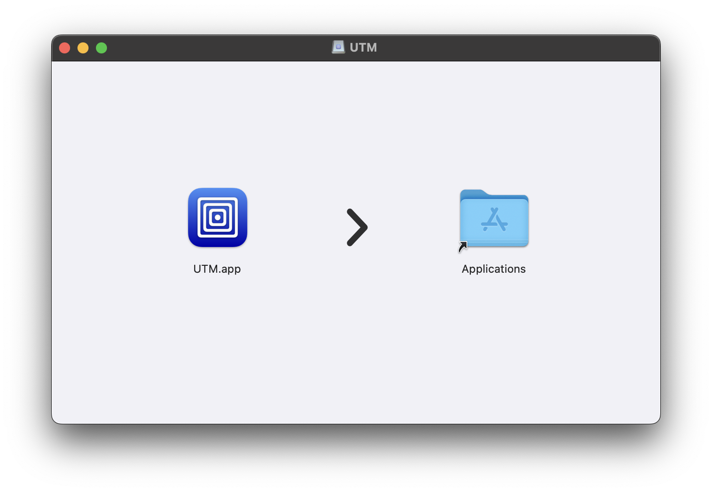  
Once copied, unmount the UTM drive from Finder or your Desktop and move the DMG file to the trash.

## Installation

Open UTM from spotlight search or the applications folder.  
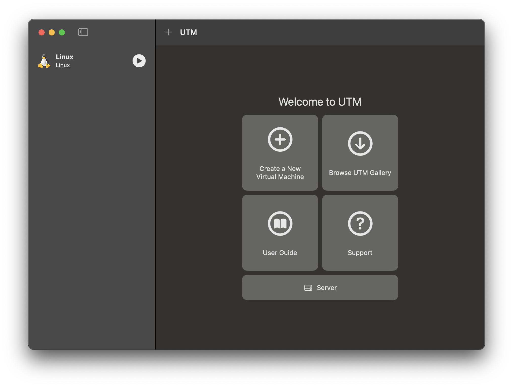  
**Select “Create a New Virtual Machine”**  
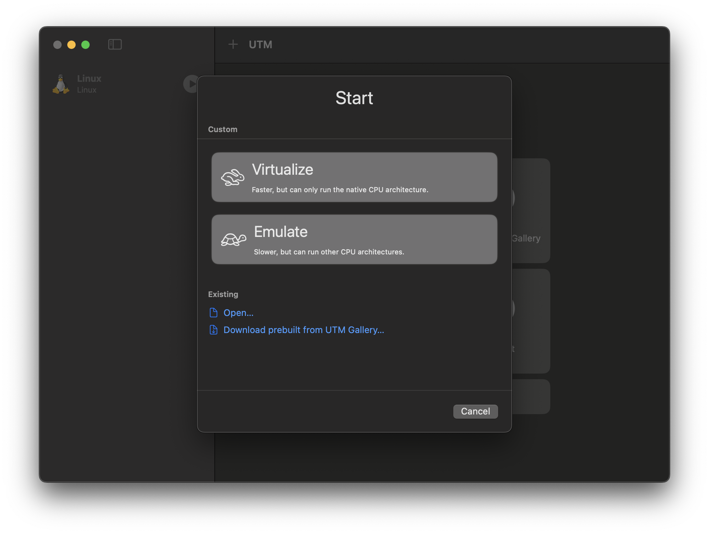  
**Select “Virtualize”**  
**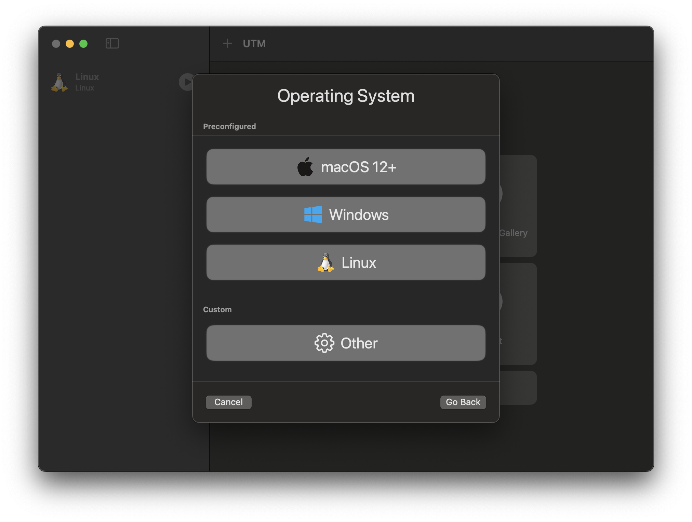**  
**Select “Linux”**  
**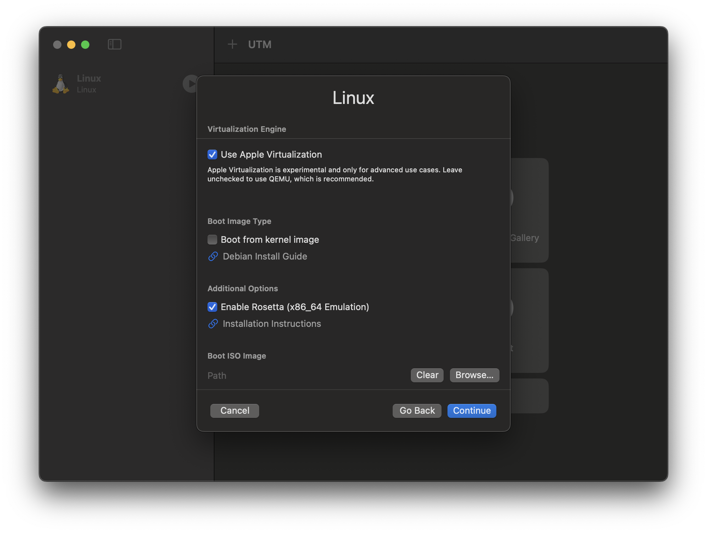**  
**Enable “Use Apple Virtualization”, “Enable Rosetta (x86\_64 Emulation)**  
**Under “Boot ISO Image”, select “Browse..” and locate and select your previously downloaded Ubuntu ISO**

**The rest of the setup options can be left default unless you wish to change them**

**Boot up your virtual machine via the Start/Play button.**

**Continue through the prompts and be sure to select the following when it appears**   
****

**Once complete, select reboot.**  
**After rebooting, you may remove the Ubuntu ISO from UTM’s homepage.**

**Log into the virtual machine and run** 

**ifconfig**

**Obtaining the ip address of the virtual machine:**  
**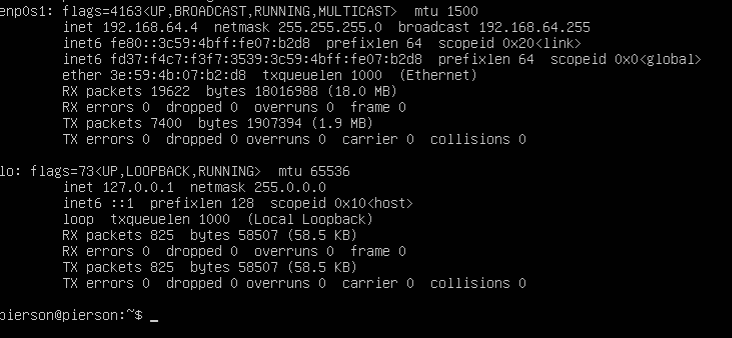**  
*Ex: 192.168.64.4*

**Run the following command to logout of the current session**

**logout**

**Minimize the UTM window and open up a Terminal window and run the following command:**

**ssh \<username\>@\<ip\>**

**Enter your password when prompted**  
****  
*Ex: ssh pierson@192.168.64.4*

**Once logged-in, run the following commands**

**sudo apt upgrade**  
**dpkg \--add-architecture 'amd64'**  
**sudo apt update**

**Install your text editor of choice\* with the following:**  
**sudo apt install nano**  
**or**  
**sudo apt install vim**

*\*For simplicity, we will be utilizing nano for the rest of this document*

**Run the following commands**  
**sudo apt install gdb-multiarch**  
**sudo apt install binfmt-support**  
**sudo apt install libc6:amd64**  
**sudo apt install gcc:amd64**  
**sudo mkdir /media/rosetta**  
**sudo mount \-t virtiofs rosetta /media/rosetta**

## Mounting the Rosetta drive on boot

We just ran the “**mount**“ command which mounts our drive temporarily  
To make the drive mount on boot, run the following commands  
**sudo su**  
*(Enter your password)*  
**nano /etc/fstab**  
Navigate to the end of the file and add the following line  
**rosetta /media/rosetta virtiofs ro,nofail 0 0**

Press Control+x, y, and then enter to save and exit nano.

Run the following command to logout of root:  
**exit**

## Installation *(cont.)*

From [this](https://docs.getutm.app/advanced/rosetta/) website, find the command listed under the “Enabling Rosetta”   
Copy the command and run it on your virtual machine

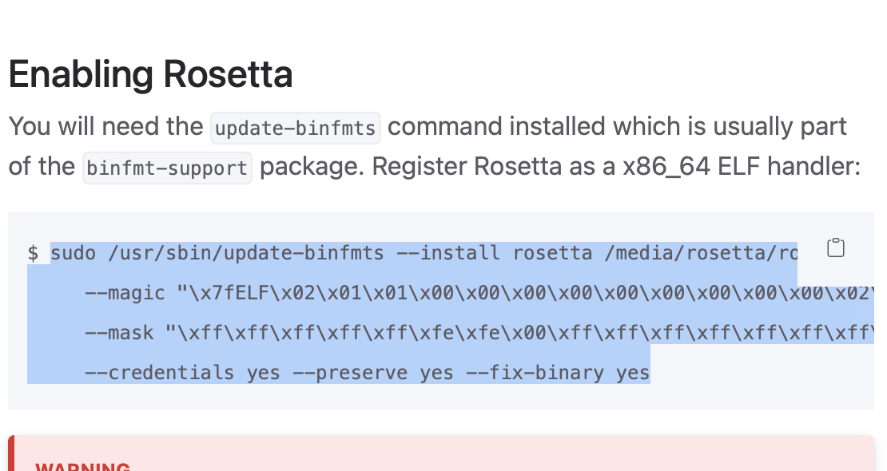

## Copying files to the Virtual Machine

To copy files from your Mac filesystem into the virtual machine can be done from the MacOS terminal with the following command:  
**scp \<file\> \<username\>@\<ip\>:\<location\>**  
Example:  
**scp /Users/pierson/Downloads/jump pierson@192.168.64.4:/home/pierson**

I tend to work within my downloads folder and send files to the home folder, which can be referred to as \~

**scp ./jump pierson@192.168.64.4:\~**

## Using GDB

Begin by copying and running the following command to enable ptrace:

**sudo su**  
**echo 0 \> /proc/sys/kernel/yama/ptrace\_scope**  
**exit**

***You will be required to repeat this process on every VM reboot***

To run gdb, you will need to open a second MacOS terminal window and ssh into the virtual machine, allowing you to have 2 sessions on the VM *(or utilize software such as **tmux**)*

On one terminal, run the following command:

ROSETTA\_DEBUGSERVER\_PORT\=1234 \<program\>

Where program is the name of the file you want to debug

Example:

ROSETTA\_DEBUGSERVER\_PORT\=1234 ./jump

In the 2nd terminal, run the following:

**gdb-multiarch**

With gdb running, enter the following:

(gdb) set architecture i386:x86-64

(gdb) file ./program

(gdb) target remote localhost:1234

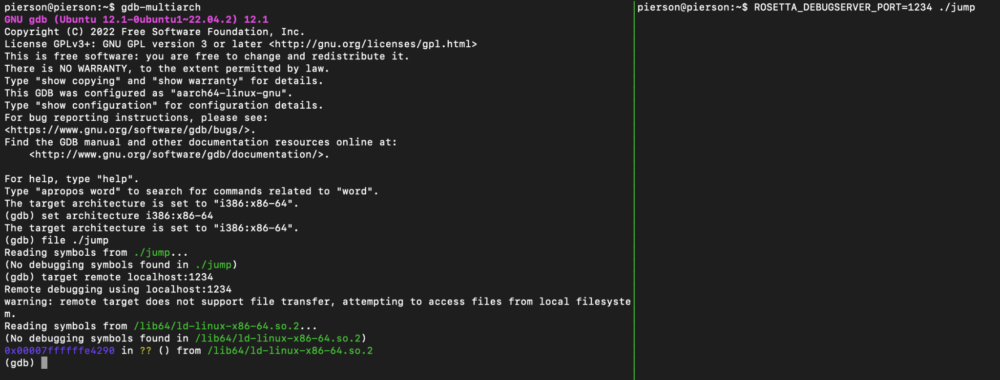

Unlike a standard gdb instance, you cannot use run or r to begin running the program.  
This program is already running, but it won't begin execution and has halted execution at the beginning.  
To begin running the program, use the following command:

(gdb) c

To restart the program, most binaries support the following:

(gdb) jump \_start

*However, this may cause unintended responses and may be advisable to restart the rosetta instance instead.*

## Configuring gdb for automatically setting architecture

You can have gdb automatically run commands on start via the .gdbinit file, you can create it with the command:

**nano \~/.gdbinit**

For example, if we want it to set the architecture automatically, we could enter the following:

set architecture i386:x86-64

If you would also like to configure GDB to automatically use Intel Assembly formatting by entering:

set disassembly-flavor intel

Press Control+x, y, and then enter to save and exit nano.

## Configuring and installing pwndbg *(advanced)*

[pwndbg](https://github.com/pwndbg/pwndbg) is a modified version of GDB offering a handful of tools useful to more advanced binary analysis, however upon attempting to install you may come across a few issues.

To install pwndbg, begin by cloning the source onto your virtual machine with the following command:

**git clone https://github.com/pwndbg/pwndbg**

Install by running the following command:

**./pwndbg/setup.sh**

Now, if you were to run **gdb-multiarch** it may appear to work, however, when attempting to target your rosetta remote, the system will throw an error. This error is in regards to pwndbg attempting to scan the remote to test if it is a qemu instance by sending a qemu-specific instruction, which makes rosetta panic. In order to fix this issue we need to bypass this check.

Open the culprit file by running the following command:

**nano ./pwndbg/pwndbg/aglib/qemu.py**

The problem function is at the top of the file, named **is\_qemu**:

**def is\_qemu() \-\> bool:**

We now need to add a line directly under the header of the function, following traditional python formatting rules, add the following line:

**return** **False**

This prevents the function from reaching the qemu test.  
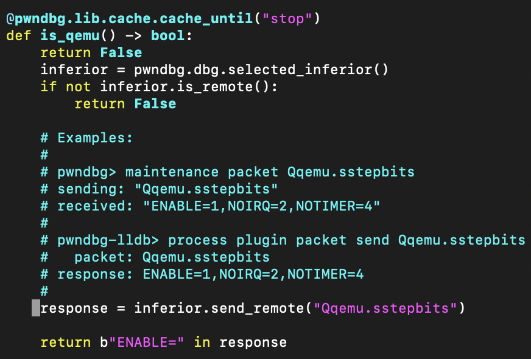

Press Control+x, y, and then enter to save and exit nano.

Now, when running **gdb-multiarch**, you should be able to debug as you would with traditional GDB, now with the added feature of pwndbg, but if you were to attempt to utilize it in its current state you may not a very frequent and apparent long delay when initially targeting the remote, and furthermore, when hitting a breakpoint. Following this long delay will display the pwndbg **context** menu, which displays a lot of data in regards to your current position and program state. This menu is useful, however in normal use can be very obnoxious when prompted against our will.

If you would like to disable the automatic context menu, begin by running the following:

**nano ./pwndbg/pwndbg/gdblib/prompt.py**

In this scenario, the problem function is further down the file, named **prompt\_hook**:

**def** **prompt\_hook**(\*a: Any) \-\> **None**:

Now we need to comment out the following lines: 

if not context\_shown and pwndbg.aglib.proc.alive and thread\_is\_stopped():  
        pwndbg.commands.context.selected\_history\_index \= None  
        pwndbg.commands.context.context()  
        context\_shown \= True

Utilize \# symbols to comment out the lines.

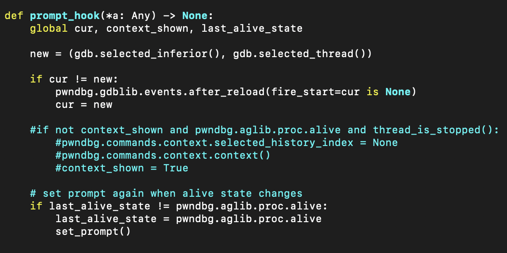

Press Control+x, y, and then enter to save and exit nano.

You should now be able to utilize pwndbg.  
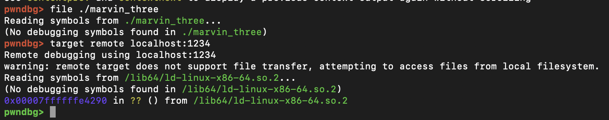  
If you would like to view the context menu, disabled from automation, use the following command:

pwndbg\> context

## Sources:

[https://stenger.io/blog/fast-gdb](https://stenger.io/blog/fast-gdb)  
[https://github.com/pwndbg/pwndbg](https://github.com/pwndbg/pwndbg)  
